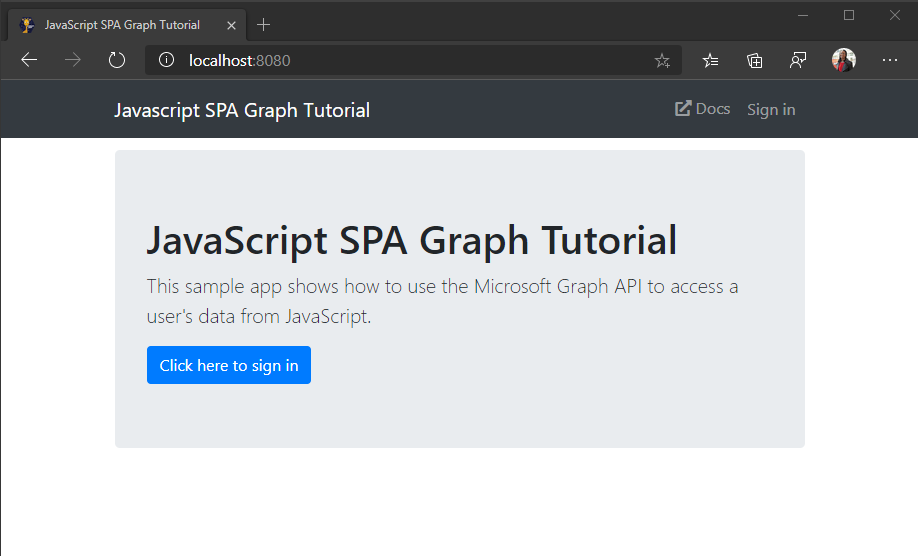

<!-- markdownlint-disable MD002 MD041 -->

Erstellen Sie zunächst ein leeres Verzeichnis für das Projekt. Dies kann auf einem HTTP-Server oder auf einem Verzeichnis auf dem Entwicklungscomputer erfolgen. Wenn sich diese auf Ihrem Entwicklungscomputer befindet, müssen Sie Sie zum Testen auf einen Server kopieren oder auf dem Entwicklungscomputer einen HTTP-Server ausführen. Wenn Sie diese nicht haben, finden Sie im nächsten Abschnitt Anweisungen.

## <a name="start-a-local-web-server-optional"></a>Starten eines lokalen Webservers (optional)

> [!NOTE]
> Die Schritte in diesem Abschnitt erfordern [Node.js](https://nodejs.org).

In diesem Abschnitt verwenden Sie [http-Server](https://www.npmjs.com/package/http-server) , um einen einfachen HTTP-Server von der Befehlszeile aus auszuführen.

1. Öffnen Sie die Befehlszeilenschnittstelle (CLI) in dem Verzeichnis, das Sie für das Projekt erstellt haben.
1. Führen Sie den folgenden Befehl aus, um einen Webserver in diesem Verzeichnis zu starten.

    ```Shell
    npx http-server -c-1
    ```

1. Öffnen Sie den Browser, und navigieren Sie zu `http://localhost:8080` .

Es sollte ein **Index of/** Page angezeigt werden. Dadurch wird bestätigt, dass der HTTP-Server aktiv ist.


## <a name="design-the-app"></a>Entwerfen der App

In diesem Abschnitt erstellen Sie das grundlegende UI-Layout für die Anwendung.

1. Erstellen Sie eine neue Datei im Stamm des Projekts mit dem Namen **index.html** , und fügen Sie den folgenden Code hinzu.

    :::code language="html" source="../demo/graph-tutorial/index.html" id="indexSnippet":::

    Dadurch wird das grundlegende Layout der APP definiert, einschließlich einer Navigationsleiste. Außerdem wird Folgendes hinzugefügt:

    - [Bootstrap](https://getbootstrap.com/) und sein unterstützendes JavaScript
    - [FontAwesome](https://fontawesome.com/)
    - [Moment.js](https://momentjs.com/)
    - [Microsoft-Authentifizierungsbibliothek für JavaScript (MSAL.js) 2,0](https://github.com/AzureAD/microsoft-authentication-library-for-js/tree/dev/lib/msal-browser)
    - [Microsoft Graph-JavaScript-Client Bibliothek](https://github.com/microsoftgraph/msgraph-sdk-javascript)

    > [!TIP]
    > Die Seite enthält ein Favicon, ( `<link rel="shortcut icon" href="g-raph.png">` ). Sie können diese Verbindung entfernen oder die **g-raph.png** Datei von [GitHub](https://github.com/microsoftgraph/g-raph)herunterladen.

1. Erstellen Sie eine neue Datei mit dem Namen **Style. CSS** , und fügen Sie den folgenden Code hinzu.

    :::code language="css" source="../demo/graph-tutorial/style.css":::

1. Erstellen Sie eine neue Datei mit dem Namen **auth.js** , und fügen Sie den folgenden Code hinzu.

    ```javascript
    function signIn() {
      // TEMPORARY
      updatePage({name: 'Megan Bowen', userName: 'meganb@contoso.com'});
    }

    function signOut() {
      // TEMPORARY
      updatePage();
    }
    ```

1. Erstellen Sie eine neue Datei mit dem Namen **ui.js** , und fügen Sie den folgenden Code hinzu.

    ```javascript
    // Select DOM elements to work with
    const authenticatedNav = document.getElementById('authenticated-nav');
    const accountNav = document.getElementById('account-nav');
    const mainContainer = document.getElementById('main-container');

    const Views = { error: 1, home: 2, calendar: 3 };

    function createElement(type, className, text) {
      var element = document.createElement(type);
      element.className = className;

      if (text) {
        var textNode = document.createTextNode(text);
        element.appendChild(textNode);
      }

      return element;
    }

    function showAuthenticatedNav(user, view) {
      authenticatedNav.innerHTML = '';

      if (user) {
        // Add Calendar link
        var calendarNav = createElement('li', 'nav-item');

        var calendarLink = createElement('button',
          `btn btn-link nav-link${view === Views.calendar ? ' active' : '' }`,
          'Calendar');
        calendarLink.setAttribute('onclick', 'getEvents();');
        calendarNav.appendChild(calendarLink);

        authenticatedNav.appendChild(calendarNav);
      }
    }

    function showAccountNav(user) {
      accountNav.innerHTML = '';

      if (user) {
        // Show the "signed-in" nav
        accountNav.className = 'nav-item dropdown';

        var dropdown = createElement('a', 'nav-link dropdown-toggle');
        dropdown.setAttribute('data-toggle', 'dropdown');
        dropdown.setAttribute('role', 'button');
        accountNav.appendChild(dropdown);

        var userIcon = createElement('i',
          'far fa-user-circle fa-lg rounded-circle align-self-center');
        userIcon.style.width = '32px';
        dropdown.appendChild(userIcon);

        var menu = createElement('div', 'dropdown-menu dropdown-menu-right');
        dropdown.appendChild(menu);

        var userName = createElement('h5', 'dropdown-item-text mb-0', user.displayName);
        menu.appendChild(userName);

        var userEmail = createElement('p', 'dropdown-item-text text-muted mb-0', user.mail || user.userPrincipalName);
        menu.appendChild(userEmail);

        var divider = createElement('div', 'dropdown-divider');
        menu.appendChild(divider);

        var signOutButton = createElement('button', 'dropdown-item', 'Sign out');
        signOutButton.setAttribute('onclick', 'signOut();');
        menu.appendChild(signOutButton);
      } else {
        // Show a "sign in" button
        accountNav.className = 'nav-item';

        var signInButton = createElement('button', 'btn btn-link nav-link', 'Sign in');
        signInButton.setAttribute('onclick', 'signIn();');
        accountNav.appendChild(signInButton);
      }
    }

    function showWelcomeMessage(user) {
      // Create jumbotron
      var jumbotron = createElement('div', 'jumbotron');

      var heading = createElement('h1', null, 'JavaScript SPA Graph Tutorial');
      jumbotron.appendChild(heading);

      var lead = createElement('p', 'lead',
        'This sample app shows how to use the Microsoft Graph API to access' +
        ' a user\'s data from JavaScript.');
      jumbotron.appendChild(lead);

      if (user) {
        // Welcome the user by name
        var welcomeMessage = createElement('h4', null, `Welcome ${user.displayName}!`);
        jumbotron.appendChild(welcomeMessage);

        var callToAction = createElement('p', null,
          'Use the navigation bar at the top of the page to get started.');
        jumbotron.appendChild(callToAction);
      } else {
        // Show a sign in button in the jumbotron
        var signInButton = createElement('button', 'btn btn-primary btn-large',
          'Click here to sign in');
        signInButton.setAttribute('onclick', 'signIn();')
        jumbotron.appendChild(signInButton);
      }

      mainContainer.innerHTML = '';
      mainContainer.appendChild(jumbotron);
    }

    function showError(error) {
      var alert = createElement('div', 'alert alert-danger');

      var message = createElement('p', 'mb-3', error.message);
      alert.appendChild(message);

      if (error.debug)
      {
        var pre = createElement('pre', 'alert-pre border bg-light p-2');
        alert.appendChild(pre);

        var code = createElement('code', 'text-break text-wrap',
          JSON.stringify(error.debug, null, 2));
        pre.appendChild(code);
      }

      mainContainer.innerHTML = '';
      mainContainer.appendChild(alert);
    }

    function updatePage(view, data) {
      if (!view) {
        view = Views.home;
      }

      const user = JSON.parse(sessionStorage.getItem('graphUser'));

      showAccountNav(user);
      showAuthenticatedNav(user, view);

      switch (view) {
        case Views.error:
          showError(data);
          break;
        case Views.home:
          showWelcomeMessage(user);
          break;
        case Views.calendar:
          break;
      }
    }

    updatePage(Views.home);
    ```

1. Speichern Sie alle Änderungen, und aktualisieren Sie die Seite. Nun sollte die APP sehr unterschiedlich aussehen.

    
